## インスタンスセグメンテーションにおけるマスク境界精度向上による3Dピッキング精度改善の検討

---

### ① 背景

京都製作所は、3DセンサとAIを組み合わせたピッキングシステム（以下3DPick）を開発した。
3DPickは、AIによるインスタンスセグメンテーションとルールベース処理を併用することで、
社内評価、実機テストでほぼ100％のピッキング精度を実現している。
マスクの比率形状や面積閾値に基づいたルールベース処理を併用する理由は以下である

- AIより出力されるマスク境界精度が不十分
  - ピッキング位置の誤差が生じるので比率形状で除外する
  - 重なったワークのピッキング時にワークを弾き飛ばすことがあるので面積閾値で除外をする
 
---

### ② 目的

本研究の目的は、ルールベース処理に依存せず、AI単体で高精度なピッキングを実現することである。
そのため、インスタンスセグメンテーションのマスク境界精度を向上させることを主眼とし、以下の
方針で検証を行う。

- 既存および新規のデータ拡張手法を導入し、学習データの多様性と質を向上させる。
- マスク境界精度に着目した損失関数を変更し、出力マスクの精度を確認する。
- IoUやクラスごとの精度・再現率、ローカライズの偽陽性数の指標を用いて、各手法の効果を定量的に評価する

---

### ③ 評価環境と方法

3DPickはHALCONのHDevelopを使用してAIモデルを作成しており、それと同一条件での比較検証を行うことで、提案手法の効果を比較評価することを目的とし、以下のデータセットおよびモデル構成を用いる。

#### 3.1 データセット

- 既存データ：社内で収集された3Dピッキング対象物のRGB-D画像（約5～20枚）  
  　　　　　拡張データの元データとなる。要アノテーション
- 拡張データ：背景変更、部分隠蔽、ノイズ付加などを施した合成画像（1,050枚）  
  　　　　　既存データからアノテーションを自動生成し、作業効率と一貫性を確保

#### 3.2 モデル構成および損失関数の重み

- ベースモデル：Mask R-CNN（ResNet50バックボーン）  
  　　　　　　　現行システムと同一構成
- 損失関数の重み比率 [バウンディングボックスの重み, クラスの重み,　マスクの重み] = [1.0,0.1,0.65]
　　　　　　　　上記項目にて調整可能

---

#### 3.3 データ拡張手法

以下の手法で作った拡張データを学習したモデルを、比較基準とする。

| No | 手法 | 目的 |
|----|------|------|
| 1 | 貼り付け | ワークの多様性向上 |
| 2 | 回転 | 姿勢バリエーションの増加 |
| 3 | バイラテラルフィルタ | ワークの平滑化とノイズ除去 |
| 4 | シャープネス強調 | ワークのエッジ強調 |
| 5 | 明暗補正 | ワークの多様性向上 |
| 6 | コントラスト補正 | ワークの多様性向上 |
| 7 | 貼り付け画像の分離管理 | よりリアルな合成 |
| 8 | アノテーション見直し（全体写り） | 不完全なマスクの排除 |
| 9 | アノテーション見直し（穴なし） | マスクの精度向上 |
| 10 | オフライン拡張 | データ量の増加 |

- 検討手法：

| 手法 | 目的 | 境界精度への期待効果 |
|------|------|------------------------|
| マスク損失の重み変更 | マスク予測への学習リソース集中 | 境界の精度向上 |
| lapクラスの統合 | クラス不均衡の解消、学習安定化 | 境界の明瞭化、誤分類の減少 |
| Gaussian Blur + ノイズ付加 | 境界の曖昧さへの耐性向上 | ロバスト性の向上、過学習の抑制 |

- 手順
  - データ拡張で生成した学習用画像1000枚を用いて、検討手法の条件を変えて学習済モデルを作成
  - 学習済モデルをDeepLearningTool読み込ませ、データ拡張で生成した評価用画像50枚を用いて、次の評価指標をもって定量評価を行う。
  - 各種、検討手法の効果を数値または目視にて確認し、考察をする。

#### 3.4 評価指標

- クラスごとの精度・再現率
- 混合行列におけるローカライズの偽陽性数（位置に関する指標）
  - 上記偽陽性のIoU（Intersection over Union）の最大最小値を確認（手作業による集計になるため簡略化する）

---

---

#### 3.5 評価ワーク

画像サイズに対するワークサイズが小、中、大と異なり、サイズによるマスク精度への影響評価に適しているため選定

|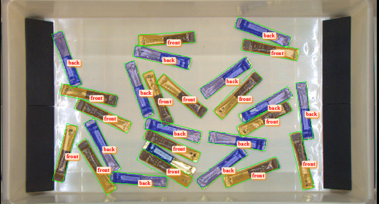Q573 味の素AGF（コーヒースティック）小|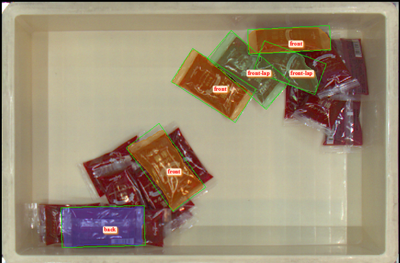 Q441 銀座コージーコーナー（フィナンシェ）中|
|-----|-----|
|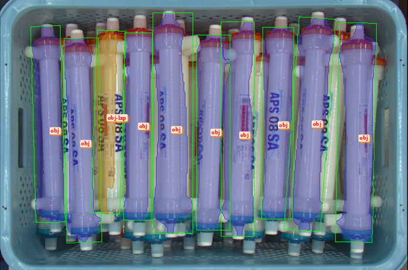Q585 旭化成メディカル（ダイアライザー）大||
　

### ④ 結果

- 損失関数のマスクの重みを0.65→1.0→0.1に変更
  - LoCが重みに応じて****となった

- lapクラス統合により、誤分類率が約***%低下
  - ワーク全体が写るクラスのLoCは最大***％減少した
  - クラスごとの精度は最大***%、再現率は***%に達した

- Gaussian Blur + ノイズ付加により、再現率が約***%向上。

---

- 出力モデルに関して
  - mean_APが最も高い時点のモデルをbest_model
  - 最終Epoch後に出力されるモデルをfinal_model
  - LoCに注目すると、final_modelの方がLoCが少ない傾向にある。
    - マスク精度を重要指標とすると、モデルはfinal_modelを採用して評価をする。

|best|final|
|-----|-----|
|精度に関して||
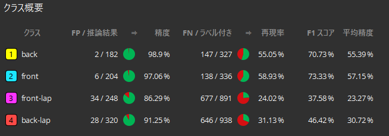|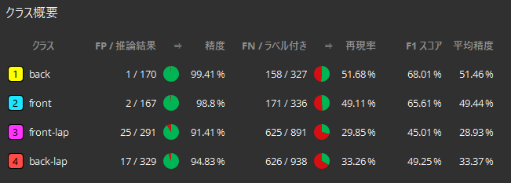|
|LoCに関して||
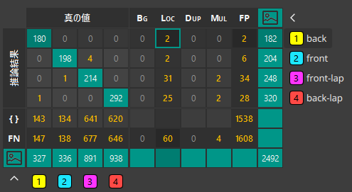|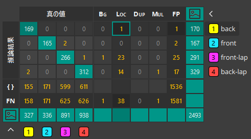|

---

|Q573 味の素AGF（コーヒースティック）|||
|-----|-----|-----|
|default|マスク重み0.65→1.0|マスク重み0.65→0.1|
|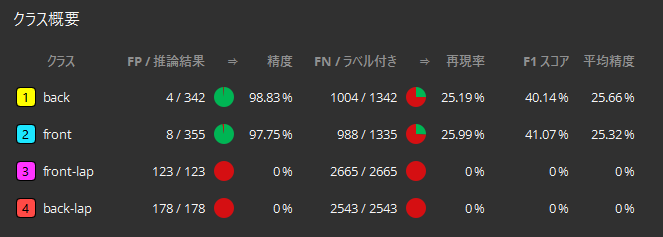|||
|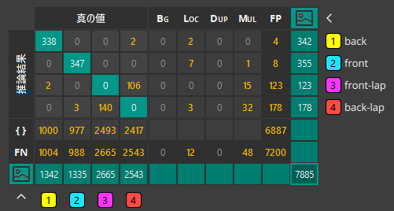|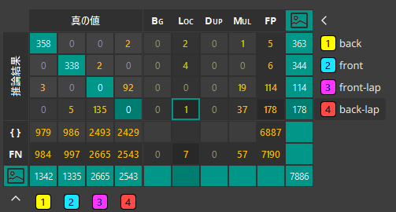||
---

|Q441_銀座コージコーナー（フィナンシェ）|||
|-----|-----|-----|
|dafult|マスク重み0.65→1.0|マスク重み0.65→0.1|
||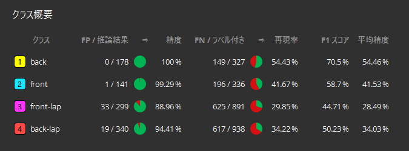|
||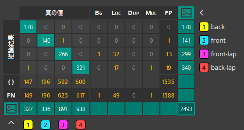|
---

---

| Q585 旭化成メディカル（ダイアライザー）|||
|-----|-----|-----|
|dafult|マスク重み0.65→1.0|マスク重み0.65→0.1|
|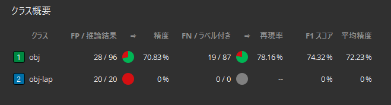|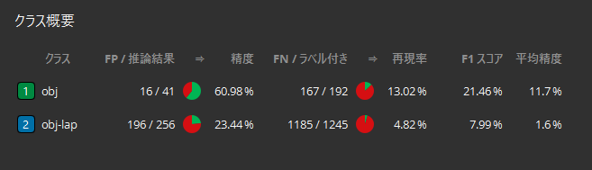|
|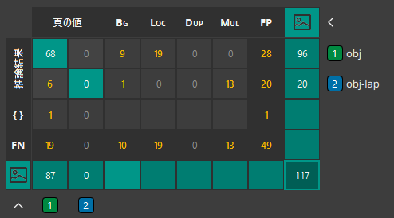|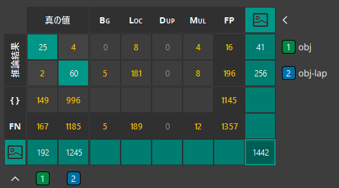|

---

---

### ⑤ 考察

---

### ⑥ 結論

